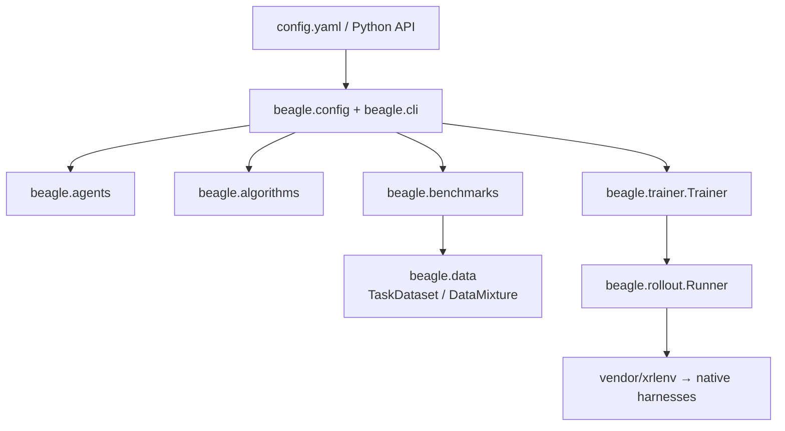

<h1 align="center">
  
  beagle
</h1>

<p align="center">
  <a href="https://www.python.org/"></a>
  <a href="pyproject.toml"></a>
  <a href="https://docs.astral.sh/uv/"></a>
  <a href="pyproject.toml"></a>
</p>

<p align="center"><b>A PyTorch-like framework for agent-harness evolution.</b></p>

<p align="center">
  <a href="#setup">Setup</a> ·
  <a href="#run">Run</a> ·
  <a href="#details--advanced">Details</a>
</p>

<table width="100%">
<tr>
<td width="50%" valign="top">
<h3>Evaluate</h3>
<p>Score <strong>your favorite agent-harness</strong> on a chosen benchmark. No evolution.</p>
<p>Each trial is driven by that benchmark's <strong>own</strong> runner (harbor, pier, upstream SWE-bench, …). beagle does not reimplement scoring. 
</td>
<td width="50%" valign="top">
<h3>Evolve</h3>
<p>Optimize the your choice of the agent harness (evolvee) <strong>source</strong> code and substrates by an <strong>agent</strong> (evolver).</p>
<p> Various evolution <strong>algorithms</strong> (e.g. DarwinX) are supported.</p>
</td>
</tr>
</table>


## Setup

### Install

```bash
git clone <beagle-url>
cd beagle
uv sync --extra all
```

In `vendor/xrlenv` is a rollout infrastructure for managing the containerized runtime environment at scale.
It requires a cluster of CPU-nodes to be set up. The user can also use the local docker daemon for development purposes.

Details about the rollout infrastructure `xrlenv` setup can be found in [xrlenv sphinx documentation](vendor/xrlenv/docs).
Use `uv run sphinx-autobuild docs docs/_build/html --open-browser --port 0` to self host the documentation.

### Prerequisites

```bash
source .venv/bin/activate
cp .env.example .env         # fill in credentials
set -a; source .env; set +a
```

### Bring your own API keys

Agents reach their model through **LiteLLM**, so bring the API key for whichever provider
you'll run — nothing else to stand up. Put it in `.env` (sourced above) and list the same
variable in the agent's `forward_env` so it reaches the run container:

```bash
# .env — set the key(s) for the model you'll use:
OPENAI_API_KEY=sk-...           # gpt-*, o-series
ANTHROPIC_API_KEY=sk-ant-...    # claude-*
# GEMINI_API_KEY / MISTRAL_API_KEY / GROQ_API_KEY / XAI_API_KEY — as your model needs
```

```yaml
# ...in the agent block of your config:
  model: {name: gpt-5.5}          # the model name selects the provider
  forward_env: [OPENAI_API_KEY]   # forwarded into the container; LiteLLM reads it
```

The model name picks the provider and LiteLLM authenticates with the forwarded key. On a
network-restricted benchmark, beagle allowlists that provider's API host automatically.


### Onboard agent experiment copies

Each evolvable agent needs an **experiment copy you own**. Onboarding pins an
upstream **commit SHA** (not a branch), seeds a parentless commit on `baseline`,
and writes `.beagle/agents/<profile>.json`.

```bash
export YOUR_ORG=<value>
# --version is the join key for generate_eval_configs.py (matches agent.harness.version)

# mini-swe — SWE-agent/mini-swe-agent
python -m beagle.tools.onboard \
    --upstream https://github.com/SWE-agent/mini-swe-agent --ref a83fcae82d2a08f0ee0c688f9d137b3566c097f8 \
    --repo $YOUR_ORG/mini_swe_agent_v2.4.6 --private --version v2.4.6 --branch-name baseline \
    --dir ../beagle-experiments/mini_swe_agent_v2.4.6 --profile-name mini_swe_agent_v2.4.6

# opencode — anomalyco/opencode  (--prune shrinks clones ~79 MB → ~12 MB)
python -m beagle.tools.onboard \
    --upstream https://github.com/anomalyco/opencode --ref a3647eb025c7615159d417dcc49fc39fdaeba65b \
    --repo $YOUR_ORG/opencode_v1.18.16 --private --version 1.18.16 --branch-name baseline \
    --prune opencode \
    --dir ../beagle-experiments/opencode_v1.18.16 --profile-name opencode_v1.18.16
```

- `--repo` — GitHub `org/name` created + pushed to
- `--dir` — local checkout (`origin` = your repo, `upstream` = source).
  Always pass it; omit and the copy lands under `.beagle/agents/` inside this repo
- `--profile-name` — manifest at `.beagle/agents/<profile>.json` (not the generator join key)
- `--branch-name` — branch for the baseline commit (default `baseline`)
- `--prune <profile>` — drop dead-weight paths (opencode only); patch-safe —
  see [docs/opencode-prune.md](docs/opencode-prune.md)

**Local vs containers.** `--dir` is for you; eval/evolve clone the **remote** `repo@ref`.

**Re-seed** with `--reseed` (destructive — don't use once candidate branches exist).
Updates remote + manifest `ref`, leaves `--dir` stale; `rm -rf <dir>` and re-run
without `--reseed` to refresh.

Batch option: `scripts/onboard_all_agents.sh`.

### Generate eval configs

Configs under `examples/evaluation/<benchmark>/<agent>.yaml` are **generated** from
your `.beagle/agents/<profile>.json` manifests:

```bash
python scripts/generate_eval_configs.py            # → examples/evaluation/<bench>/<agent>.yaml
python scripts/generate_eval_configs.py --smoke    # → tests/smoke/<agent>_smoke/*_smoke2.yaml
python scripts/generate_eval_configs.py --check    # dry-run: onboarded vs missing
```

```bash
beagle evaluate --config examples/evaluation/swe-bench-verified/opencode.yaml --dry-run
```

Only `version` must line up (matrix `version` ↔ onboard `--version`). Edit `AGENTS` /
`BENCHMARKS` / `DEFAULTS` in the script to change the matrix, then regenerate.

One `config.yaml` drives both modes — evaluation just drops `evolver` + `algorithm`:

- **evolution** → [examples/quick-start/config.yaml](examples/quick-start/config.yaml)
- **pure eval** → [examples/evaluation/](examples/evaluation/) (generated)

```yaml
run:      {dir, name, runtime, parallelism}
evolvee:                                    # θ — harness under evolution
  agent:  {name, version, source}           # type + version + INLINE source
  model:  {name}
  provider / forward_env                    # LLM routing (provider + key(s) to forward)
  effort / max_turns / timeout / extra_args # agent knobs (extra_args = CLI)
evolver:  {agent: {name, version}, model}   # proposer (e.g. cursor-agent)
algorithm: {name: darwinx, hparams: {…}}    # optimizer + typed knobs
data:     [{benchmark, tasks}]              # benchmark + tasks
```

**Derive** `evolvee.agent.source` from the onboard manifest (`.beagle/agents/<profile>.json`,
written by onboarding) — don't hand-write it. For the mini-swe copy onboarded above:

```json
{
  "profile": "mini_swe_agent_v2.4.6",
  "version": "v2.4.6",
  "repo": "https://github.com/<your-org>/mini_swe_agent_v2.4.6",
  "ref": "<baseline commit>",
  "branch": "baseline",
  "token_env": "GH_TOKEN",
  "upstream": "https://github.com/SWE-agent/mini-swe-agent",
  "upstream_ref": "a83fcae…",
  "dir": "../beagle-experiments/mini_swe_agent_v2.4.6"
}
```

Paste `repo` / `ref` / `token_env` / `dir` 1:1 into `evolvee.agent.source.*`.
Add `agent.name` (adapter — `mini-swe`) and `agent.version` (label). LLM routing
(`forward_env`) and CLI flags live on the **agent** block, not the model block.

Validate with `python -m beagle.config <file>` (`extra=forbid` — unknown fields hard-error).

- `data.tasks: [...]` selects by id; omit to run the whole suite. No `limit` / first-N.
- **Version gate.** Black-box agents check `agent.version` against the installed CLI
  and fail loud on mismatch; source-versioned agents (pinned by `source.ref`) are exempt.

---

## Run

Preview with `--dry-run` first (resolve + plan + version gate — no spend), then drop the flag:

```bash
# EVOLUTION
beagle evolve   --config examples/quick-start/config.yaml --dry-run
beagle evolve   --config examples/quick-start/config.yaml

# PURE EVALUATION (generate configs first)
beagle evaluate --config examples/evaluation/swe-bench-verified/mini-swe.yaml --dry-run
beagle evaluate --config examples/evaluation/swe-bench-verified/mini-swe.yaml
```

<table width="100%">
<tr>
<td width="50%" valign="top">
<h4>Evolution</h4>
<p>seed θ → baseline → evolver edit → candidate eval → keep/reject</p>
<p>Lands the best node + a candidate branch on your experiment copy.</p>
</td>
<td width="50%" valign="top">
<h4>Pure eval</h4>
<p>clone <code>repo@sha</code> → native harness → score + per-task rewards</p>
</td>
</tr>
</table>

Both write native `agent/` + `verifier/` + `run.json` under `<run.dir>/<run.name>/`.

Later: `git -C <your-checkout> fetch upstream` to sync from upstream.

### Evaluate — resume & retry

`beagle evaluate` reads each harness's **native** tree, so runs are resumable.
Categories split on one signal: did the trial record an error?

| Category | Meaning | Re-run with |
| --- | --- | --- |
| **missing** | no `result.json` (interrupted) | `--resume` |
| **error** | any recorded error (500, timeout, clone fail, no-attempt, …) | `--retry-errors` |
| **genuine-fail** | unresolved, no error (real attempt that didn't pass) | `--retry-unresolved` |
| **resolved** | passed | *never* |

Flags are **independent** — combine to union. Resolved tasks are never re-run.

| You pass | Re-runs |
| --- | --- |
| *(nothing)* | everything (fresh) |
| `--resume` | missing |
| `--retry-errors` | error |
| `--retry-unresolved` | error + genuine-fail |
| `--resume --retry-errors` | missing + error |
| `--resume --retry-unresolved` | missing + error + genuine-fail |

- Add `--dry-run` to any combo to print the plan without rolling out.
- `--retry-errors` re-runs every errored task — your call; never re-runs genuine fails.
- `--retry-unresolved` is the blunt superset (includes genuine fails). Use for
  deliberate re-sampling (pass@k / harness fix), not “the agent failed a task.”
  Ungraded trials (neither reward nor error) fail loud — grade first.
- Infra/setup failures and empty patches are stamped `NoAttempt` (errored), so
  `--retry-errors` catches them without hand-deleting `result.json`.
- `--task-ids t1,t2,…` restricts *which* tasks re-run — not a dataset filter.
  Full `run.json` aggregate stays whole; only named tasks re-run.
- `--force-resume` allows resume across a config change (records both hashes).
  In-run retry: `run.retry.infra` / `run.retry.content`.

### Evolve

`beagle evolve` runs the loop named by the `algorithm` block — DarwinX unless you swap it.
One config is one **campaign**: every node it scores is recorded in a genealogy DB, so
re-launching the same config continues the tree instead of starting over.

```bash
beagle evolve --config examples/quick-start/config.yaml --dry-run   # resolve + plan, no spend
beagle evolve --config examples/quick-start/config.yaml
```

Each pipeline (one proposal attempt against one parent) walks these phases:

| Phase | What happens |
| --- | --- |
| **seed** | θ (the `evolvee`) is cloned once under `repo_root`; each pipeline gets its own worktree |
| **baseline** | the parent is scored on the subset — skipped when that parent already has a score |
| **propose** | the `evolver` edits the worktree; its diff is the candidate |
| **score** | the candidate runs the same tasks at the same budget as the baseline |
| **gate** | keep / reject — verification gates, guard (canary) tasks, equivalence, anti-cheat |
| **land** | a kept node is committed and pushed as `evolve/<parent-sha>__<pipeline-id>` |

Nodes end as `completed`, `no_change`, `rejected`, or `failed`. **`no_change` is a normal
outcome** — the proposer found nothing that survived the gate — not an error.

**Which tasks.** DarwinX is single-benchmark, so it evolves on `data[0]`. `tasks` is the
subset it optimizes against; `options.priority_tasks` / `variance_tasks` / `fullset_tasks`
stratify it further. All optional — omit them and the driver's own defaults stand.

**Knobs** go under `algorithm.hparams` and are typed (`extra='forbid'`, so a typo fails at
load instead of being silently ignored). The ones you reach for first:

| Knob | Controls |
| --- | --- |
| `max_loop_iters` | proposal attempts per pipeline before it gives up |
| `subset_eval_n_attempts` / `fullset_eval_n_attempts` | avg@k on the subset / on the scoring set |
| `mini_eval_k_samples` | cheap screen before committing to a full re-score |
| `parent_strategy` | which scored node the next pipeline branches from |
| `node_score` | `panel` (fixed task panel) or `mixture` (multi-benchmark) |
| `gate_enabled` · `anti_cheat` | the accept/reject machinery |
| `guard_enabled` · `guard_strict` | canary tasks a candidate is not allowed to regress |
| `absorb_timeouts` · `infra_retries` | keep infra flakiness out of the score |

That is the short list; the full surface is `DarwinXConfig` in
[beagle/algorithms/darwinx/config.py](beagle/algorithms/darwinx/config.py), which is also
where each knob's meaning is documented.

**What you get.** Under `<run.dir>/<run.name>/`, per campaign: `state.db` (the genealogy),
`nodes/<node-id>/` and `pipelines/<pipeline-id>/` for per-node and per-attempt logs, the
worktrees, and `_evals/` holding the raw native harness trees. Kept branches land on your
experiment copy; the CLI prints the best node when the campaign finishes.

---

## Details & advanced

### Modules



Pure eval uses the same lower half: `beagle evaluate` → agent + dataset →
`beagle.eval` / `beagle.rollout` (no evolver / algorithm).

| Area | Path |
| --- | --- |
| Public facade | `beagle/__init__.py` |
| Config + CLIs | `beagle.config`, `beagle.cli` |
| Agents | `beagle.agents` |
| Algorithms | `beagle.algorithms` |
| Training loop | `beagle.trainer` |
| Data | `beagle.data` |
| Benchmarks | `beagle.benchmarks` |
| Rollout | `beagle.rollout` |
| Evaluation | `beagle.eval` |
| Tools | `beagle.tools` |
| Substrate | `vendor/xrlenv` |
| Examples / tests / notes | `examples/`, `tests/`, `notes/` |

### Onboard your own agent

Role (evolvee vs evolver) is chosen at **run time**, not baked into the agent.
Declare capabilities via mixins; `Trainer` checks the role you assign is supported:

| Capability | Implement | Meaning |
| --- | --- | --- |
| `Runnable` | `run` | attempt tasks (be scored) |
| `Evolvable` | `_default_source` | versioned git source (`repo@ref`) |
| `Editor` | `edit` | run one coding instruction (be an evolver) |

Evolvee = `Runnable` + `Evolvable`; evolver = `Editor`. The evolver is a thin
primitive — the algorithm owns prompts and the analyze/implement/review recipe.
Drop one package under `beagle/agents/` — no other edits:

```python
# beagle/agents/my_agent/__init__.py
from beagle.agents.core import Agent, AgentSource, Runnable, Evolvable, register
from beagle.rollout.runtime import ContainerRuntime
from beagle.types import Task, TaskContext, TaskResult

@register("my-agent")
class MyAgent(Agent, Runnable, Evolvable):   # white-box — usable as evolvee
    def _default_source(self):
        # source comes from run config (your experiment copy). entrypoint is intrinsic.
        return self.spec.source or AgentSource(entrypoint="bin/my-agent")

    def run(self, task: Task, task_ctx: TaskContext, *, runtime: ContainerRuntime) -> TaskResult:
        src = self.source()                   # baseline ref, or evolved candidate
        handle = runtime.acquire(image=task_ctx.image or "", command=["sleep", "infinity"])
        try:
            ...  # clone src.repo@src.ref, build, run, collect patch
            return TaskResult(task_id=task.task_id)
        finally:
            runtime.destroy(handle)
    # add Editor + edit(instruction, workspace, ...) to also serve as evolver
```

Auto-discovered on `import beagle`. One `run` works on every harness — you never
write harness-specific code. Closed-source CLI you can't evolve:
`class MyAgent(Agent, Editor)`. Start from `beagle/agents/core/_template.py`.
Benchmarks and algorithms onboard the same way — one file, `@register`, done.

### Prefer Python?

The CLI is a thin wrapper. Compose the pieces yourself (PyTorch-shaped
model / optimizer / dataloader → `fit`):

```python
import beagle as bgl

trainer = bgl.Trainer(
    evolvee=bgl.agents.build(evolvee_config),
    evolver=bgl.agents.build(evolver_config),
    algorithm=bgl.algorithms.build(darwinx_config),
    trainer_config={"runtime": {"kind": "xrlenv-cluster"}},
)
best = trainer.fit(train_dataset=bgl.TaskDataset.from_benchmark(benchmark_config))

bgl.evaluate(run_config)   # pure eval — no evolver/algorithm
```

Full example: [examples/quick-start/quick_start_inline.py](examples/quick-start/quick_start_inline.py).
Build by name: `bgl.agents.build(...)`, `bgl.algorithms.build(...)`,
`bgl.benchmarks.get(...)`.

> **Status.** Both paths run today from one `config.yaml` — pure evaluation and the
> DarwinX loop (baseline → edit → candidate eval → keep/reject → best node + branch).
> `Trainer.fit`, DarwinX, and the version gate are wired end-to-end; `DataMixture` is
> the main piece still landing.
