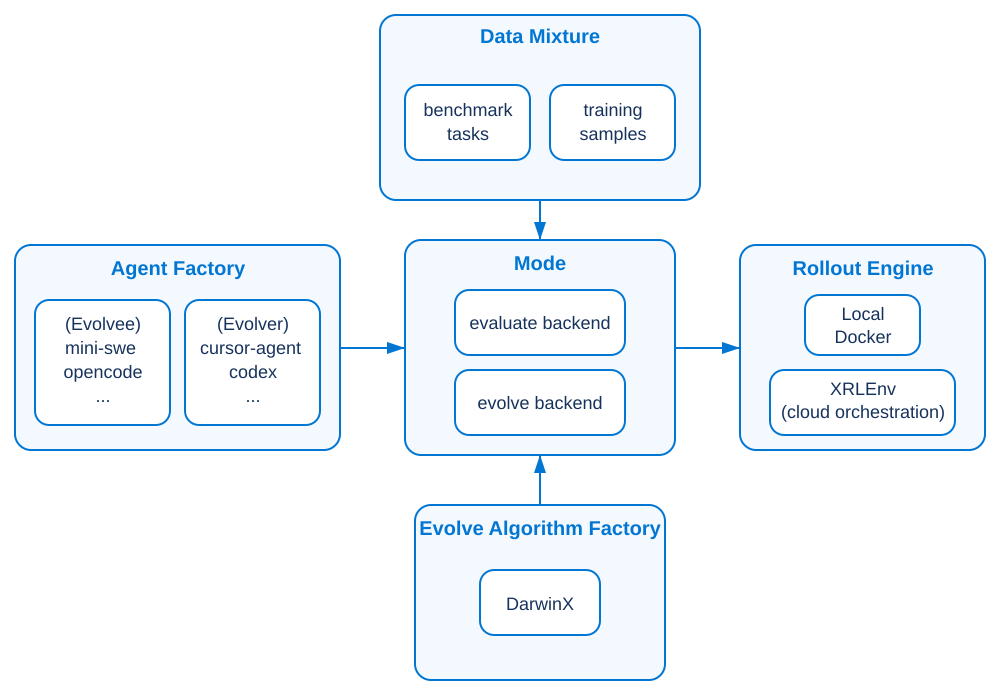
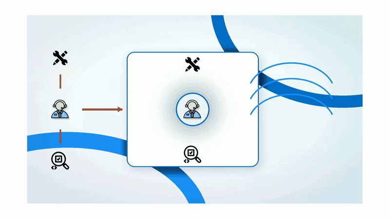

<h1 align="center">
  
  beagle
</h1>

<p align="center">
  <a href="https://www.python.org/"></a>
  <a href="pyproject.toml"></a>
  <a href="https://docs.astral.sh/uv/"></a>
  <a href="CHANGELOG.md"></a>
</p>


<p align="center">
  <a href="#setup">Setup</a> ·
  <a href="#evaluate">Evaluate</a> ·
  <a href="#evolve">Evolve</a>
</p>

`Beagle` is a framework that allows users to **evaluate and evolve agent harnesses at scale**.  

As it's initial relase, `Beagle` ships the official implementation of [**DarwinX**]((https://arxiv.org/html/2608.07545v1)) as the core evolution algorithm: with an evolvable agent harness and verifier-backed tasks,`DarwinX` searches for harness changes that improve capability while guarding against regressions.

More features will be added to `Beagle` in the future. The mission of `Beagle` is to allow users to bring their favorite agent harness and tasks; then `Beagle` evolves it into a stronger agent harness that generalizes robustly to new challenges.

<table width="100%">
<tr>
<td width="50%" valign="top">
<p><strong>Evaluate</strong></p>
<p>Score <strong>your favorite agent-harness</strong> on chosen benchmarks.</p>
<p>Each evaluation trial is faithfully driven by the benchmark's <strong>own</strong> framework (harbor, pier, and more).
</td>
<td width="50%" valign="top">
<p><strong>Evolve</strong></p>
<p>Optimize the agent harness (evolvee) by (another) <strong>agent</strong> (evolver).</p>
<p>Various evolution <strong>algorithms</strong> (e.g. DarwinX) are supported.</p>
</td>
</tr>
</table>

<p align="center">
  <a href="docs/assets/beagle-architecture.svg">
    
  </a>
</p>


# 🔈 News

- **2026-09-02** — We open-sourced `Beagle`, the framework supporting the `DarwinX` project.
- **2026-07-31** — We released the preprint **DarwinX: Evolving Agent Harnesses Through Natural Selection**.
  * [Preprint link](https://arxiv.org/html/2608.07545v1)  | [Project page](https://huggingface.co/spaces/CoderDoge/darwinx)


| Benchmark | Previous SOTA | Monet (Baseline) on GPT-5.5 (high) | Monet (w DarwinX) on GPT-5.5 (high) | Monet (w/ DarwinX) on the Best Model | Delta| Comment | 
|---|---|---|---|---|---|---|
| `terminal-bench 2.1` (pass@5) | Fable 5 (xhigh): 83.8±1.2 | 75.5±3.5 |  83.2±1.2 | GPT-5.6 Sol (medium): 84.7±1.2 | +7.7 / +9.2 | benchmark-native test-time evolution |
| `terminal-world` (pass@1) | Claude Code + Opus 4.8 (xhigh): 65.9 | 48.8 | 56.1 | Opus 4.8 (xhigh): 68.3 | +7.3 / +19.5 | evolves on 94 train-set; evaluate on 41 test-set |
| `Webarena-Infinity` (pass@1) | BrowserUse + Gemini 3 Flash: 69.3 | 43.5 | 93.0 | - | +49.5 | Monet added the `browser_execute` action from  [BrowserCode](https://github.com/browser-use/browsercode)  |
| `SWE-bench-verified` (pass@1) | Fable 5: 95.0 | 80.8 | 84.2 | - | +3.4 |  This evaluation used the evolved Monet on `terminal-bench 2.1` to show transferbility.  |


<a name="setup"></a>
# ⚙️ Setup

## Installation

Install `Beagle` and configure the environment variables.

```bash
git clone https://github.com/SalesforceAIResearch/Beagle
# run the installation script; we use uv to manage the dependencies
cd Beagle &&  bash scripts/install.sh
```

Then fill in the environment in `.env`:
```bash
cp .env.example .env
```

<details>
<summary><strong>Notes on the environment variables in `.env`</strong></summary>

* `YOUR_ORG`: the github organization or username you want to use to host your agent harnesses. For example, if any of your repo's url like `https://github.com/<user-name>/<repo-name>`, then your `YOUR_ORG` should be `<user-name>`.

* `GH_TOKEN`: a `Personal access tokens (classic)` with `repo` and `project` scopes configured. Refer to [Creating a fine-grained personal access token](https://docs.github.com/en/authentication/keeping-your-account-and-data-secure/managing-your-personal-access-tokens#creating-a-fine-grained-personal-access-token) for more details.

* `OPENAI_API_KEY, ANTHROPIC_API_KEY, ...`: API keys for the models you want to use. Put credentials in `.env` and list variables that must enter the run container under `forward_env` (see [examples/evaluation/01-minimal.yaml](examples/evaluation/01-minimal.yaml)). `forward_env` is generic container plumbing and is independent of the selected provider route.
  * *No first-party key?* If your org fronts providers with an **OpenAI-compatible gateway**, select `provider.type: gateway`, give it a required `name`, and put `api_base`, `api_key_env`, and optional `auth_header` under `provider.extra_args`. See [examples/evaluation/07-org-gateway.yaml](examples/evaluation/07-org-gateway.yaml).
  * We didn't test all model providers for all agent harnesses. If you find any issues, please report to us.

* `XRLENV_BENCHMARK_CACHE`: the shared root containing benchmark task corpora. Set this for cache-backed benchmarks even when rollouts use local Docker. The default value is `.cache/xrlenv_benchmark_cache`.

* `XRLENV_GRPC_HOST, XRLENV_GRPC_PORT, XRLENV_CONSUMER_TOKEN`: credentials for the xrlenv rollout infrastructure. Only needed if you are using the `xrlenv` rollout infrastructure. Refer to [xrlenv sphinx documentation](vendor/xrlenv/docs) for more details.
</details>


### Runtime prerequisite

Evaluation & evolution requires docker container runtime:

- **Local Docker** (default): install [Docker Engine](https://docs.docker.com/engine/install/) or [Docker Desktop](https://docs.docker.com/desktop/) based on your platform; start the daemon, and verify with `docker info`.
- **xrlenv cluster**: for large-scale evaluation & evolution, you can use the [xrlenv rollout infrastructure](vendor/xrlenv). Refer to [xrlenv sphinx documentation](vendor/xrlenv/docs) for more details.

The generated example configs default to local Docker.

## Prepare your agent harnesses experiment copies 

> This step is required for evolution; recommended for evaluation.

The design philosophy of `Beagle` is to treat the agent-harness as the data. To evolve the agent-harness, we need to onboard the agent-harness into your own repository so that we can evolve it.

The script below onboards the sample agent-harnesses into your own GitHub repository.
```bash
bash scripts/onboard_all_agents.sh
```

For users who want transpaency, we encourage you to read the script for more details and read the manual onboarding section below.
<details>
<summary><strong>Manual onboarding</strong></summary>

We encourage you to read below for more details as you use cases become more complex, e.g., managing multiple agent harnesses and different versions of the same agent harness.

Some examples:
```bash
# mini-swe — SWE-agent/mini-swe-agent
python -m beagle.tools.onboard \
    --upstream https://github.com/SWE-agent/mini-swe-agent --ref a83fcae82d2a08f0ee0c688f9d137b3566c097f8 \
    --repo $YOUR_ORG/mini_swe_agent_v2.4.6 --private --branch-name baseline \
    --dir ../beagle-experiments/mini_swe_agent_v2.4.6 \
    --version v2.4.6 --profile-name mini_swe_agent_v2.4.6

# opencode — anomalyco/opencode  (--prune shrinks clones ~79 MB → ~12 MB)
python -m beagle.tools.onboard \
    --upstream https://github.com/anomalyco/opencode --ref a3647eb025c7615159d417dcc49fc39fdaeba65b \
    --repo $YOUR_ORG/opencode_v1.18.16 --private --branch-name baseline \
    --dir ../beagle-experiments/opencode_v1.18.16 \
    --version 1.18.16 --profile-name opencode_v1.18.16 \
    --prune opencode
```

Notes on the flags:
- `--upstream`: the upstream repository of the agent harness.
- `--ref`: either branch name or the commit SHA of the agent harness to onboard; (specify it as `--ref <branch-name>` if you want to onboard the latest commit on the branch, otherwise specify it as `--ref <commit-sha>`); we recommend using the commit SHA for reproducibility.
- `--repo`: specify you own github account (`$YOUR_ORG`) and repo name the agent harness will be created and pushed to;
- `--private`: if you want to create a private repository for the agent harness, set this flag to `true`; otherwise, set it to `false`.
- `--branch-name`: this is the branch name used in you own repository (default `baseline`).
- `--dir`: your local checkout of the agent harness; for this local checkout, `origin` is your repository and `upstream` is the upstream repository.
  Always pass it; omit and the copy lands under `.beagle/agents/` inside this repo, which is not what you want.
- `--version`: the version of the agent harness to onboard; this is the join key for `scripts/generate_eval_configs.py` to match the agent harness.
- `--profile-name` — manifest at `.beagle/agents/<profile>.json`; used to generate or handwrite the eval configs (detailed in [Evaluate](#evaluate) section)
- `--prune <profile>` — drop dead-weight paths (opencode only); patch-safe — see [docs/opencode-prune.md](docs/opencode-prune.md)
</details>

## Quick Start

### Step 0: Populate the benchmark cache

Populate every cache-capable registered benchmark. The copied `.env.example` defaults
to the project-local `.cache/xrlenv_benchmark_cache`; override it in `.env` or pass
`--dest` when you need a shared location:
```bash
# Downloads the four currently registered cache-backed corpora; reruns are idempotent.
.venv/bin/python scripts/populate_benchmarks_cache.py

# Or populate only what you need (repeat --benchmark to select several).
.venv/bin/python scripts/populate_benchmarks_cache.py \
  --benchmark terminal_bench_2_1
```
The population command and `beagle evaluate` both load `.env`; they must point at the same root.
Population retries transient HTTP failures three times and hides per-request HTTP logs by default;
use `--show-http-logs` for network diagnostics.
This is a one-time operation and is required for cache-backed benchmarks.

### Step 1: Generate experiment configuration files

Experiment runs are configuration-file driven. The generation scripts read the agent repository,
baseline commit, and local checkout from the manifests created during onboarding. Modify the
generated configs for your use case; field guidance is in [Evaluate](#evaluate) and
[Evolve](#evolve).

The scripts below generate 2-task smoke samples under `tests/smoke/` for both evaluation and
evolution:

```bash
source .venv/bin/activate
python scripts/generate_eval_configs.py       # → tests/smoke/<bench>/<harness>-<version>_smoke2.yaml
python scripts/generate_evolution_config.py   # → tests/smoke/<bench>/<harness>-<version>_darwinx_evolution_smoke2.yaml
```


There are additional examples provided in the `examples/evaluation` folder on advanced use cases, like 
evaluating a subset of tasks from a benchmark, excluding some tasks, running a mixture of benchmarks, and more.

### Step 2: Run a smoke experiment

#### Evaluation
```bash
# Preview the run plan without spending.
beagle evaluate --config tests/smoke/terminal_bench_2_1/opencode-1.18.16_smoke2.yaml --dry-run
# Launch the two-task evaluation.
beagle evaluate --config tests/smoke/terminal_bench_2_1/opencode-1.18.16_smoke2.yaml
```
By default, evaluation artifacts go to `./tmp/<run.name>/` and preserve the original
benchmark runner's artifact shape.

#### Evolution

```bash
# Preview one generated two-task DarwinX smoke without spending.
beagle evolve --config tests/smoke/terminal_bench_2_1/opencode-1.18.16_darwinx_evolution_smoke2.yaml --dry-run
# Launch it (uses evolver and evolvee model credits).
beagle evolve --config tests/smoke/terminal_bench_2_1/opencode-1.18.16_darwinx_evolution_smoke2.yaml
```

The generator writes the same evolution smoke for every onboarded reference harness; select the
corresponding `<harness>-<version>` file to use another one. All run choices are visible in its
YAML. See the
[evolution quick start](examples/evolution/README.md) for prerequisites and outputs, then
[Configure DarwinX](docs/darwinx-configuration.md) before expanding the task set or enabling
additional selection and verification mechanisms.

---

<a name="evaluate"></a>
# 📊 Evaluate

Score an agent harness on a benchmark. Each task rolls through the benchmark's **own** runner
(harbor, pier, raw container path, etc.) → graded → summarized results; beagle does not reimplement scoring process.

## Supported benchmarks

| Registry name | Tasks | Benchmark Harness |
|---|---|---|
| `terminal_bench_2_1` | 89 | `Harbor` | 
| `swe-rebench` | 860  | `Harbor` | 
| `deep-swe` | 113  | `Pier`  | 
| `swe-bench-verified` | 500 | Beagle's `DockerHarness` |

**More benchmarks are to be added soon.**

`beagle` runs **whatever the benchmark's corpus contains**. It does not filter tasks for you: a task's oracle
can give you zero reward if upstream dependencies are missing, changed or broken [**docs/benchmark-remarks.md**](docs/benchmark-remarks.md) lists them per benchmark
with the measured evidence; exclude them per run with `exclude_task_ids`. See the documentation for more details.

## Generate eval configs

Three set of config files are provided for different purposes.

* The `examples/evaluation/*.yaml` is provided for user reference. 

* The `experiments/configs/eval_baseline/…` and ``tests/smoke/<bench>/<harness>-<version>_<variant>.yaml` are generated by scripts since the remaining two ties to your own agents's mainfest generated after the onboarding in `.beagle/agents/<profile>.json`. 

```bash
# both read your onboarded manifests in .beagle/agents/<profile>.json
# every copy × benchmark on 2 seeded-sample tasks for smoke testing
python scripts/generate_eval_configs.py              # → tests/smoke/<bench>/<harness>-<version>_smoke2.yaml
# full-benchmark sweeps 
python experiments/scripts/generate_eval_configs.py  # → experiments/configs/eval_baseline/<harness>-<version>_<bench>_<model>_<effort>_<turns>.yaml


# advanced — generate for one agent/benchmark, or at different knobs (each combination gets its own file)
python experiments/scripts/generate_eval_configs.py --check                                   # list, write nothing
python experiments/scripts/generate_eval_configs.py --agents opencode-1.18.16 --benches swe-rebench
python experiments/scripts/generate_eval_configs.py --model gpt-5.6 --effort high --max-turns 150
```

By default, both generators include mini-swe and OpenCode, use `gpt-5.6-sol` with medium effort,
run with the local Docker daemon, route directly to the model provider, and forward
`OPENAI_API_KEY`. Every generated config includes an explicit provider block. Use `--model`,
`--effort`, `--runtime`, `--provider-type`, `--provider-name`, and `--forward-env` to override
those defaults. Gateway overrides additionally use `--provider-api-base`,
`--provider-api-key-env`, and optionally `--provider-auth-header`.

<details>
<summary><strong>Deep dive into the config files</strong></summary>

Both scripts fill in the part that is yours — the agent's repo and commit, read from the
`.beagle/agents/<profile>.json` that onboarding wrote:

```yaml
run:
  timeout_multiplier: 1.0  # scales task-defined agent and verifier time limits

agent:
  harness:
    name: opencode          # which adapter runs it
    version: 1.18.16        # WHICH COPY — the `--version` you onboarded with
    source:                 # filled in for you, from that file
      repo: https://github.com/<you>/opencode_v1.18.16
      ref: a3647eb0…
  timeout: 1800             # fallback only when the benchmark defines no agent time limit
```

Onboarding (`python -m beagle.tools.onboard`) writes a manifest containing the harness's `version`, repository, and commit. The
generator's agent table in `scripts/generate_eval_configs.py` declares which harness versions to
generate. The generator matches these two records by exact `version`; for example, its OpenCode
`1.18.16` entry reads repository details from the onboarded `1.18.16` manifest. If those versions
do not match, that harness is skipped. Pass `--check` to either generator to preview matched and
skipped harnesses without writing files.

To add an agent or a benchmark — or a second copy of an agent you already have — edit the tables at
the top of `scripts/generate_eval_configs.py`; the sweep script reads the same ones. Files are named
`<agent>-<version>`, so two copies of one agent (say, before and after a change) never overwrite each other.

The two timeout fields shown above have different roles. `run.timeout_multiplier: 1.5` gives each
task 1.5× its benchmark-defined agent and verifier budgets. `agent.timeout` is only a fallback for
benchmarks that define no agent budget. See
[05-timeouts.yaml](examples/evaluation/05-timeouts.yaml).

Different agent-harness may have different extra arguments to be passed. Please see [08-harness-extra-args.yaml](examples/evaluation/08-harness-extra-args.yaml) for more details.

</details>

Whatever you generate or hand-write, `beagle evaluate --config <file> --dry-run` resolves it and prints the plan without spending anything.

You are encourged to generate more configs yourself or handwrite them for your own use cases.

## Run an evaluation

```bash
# plan only, no spend
beagle evaluate --config tests/smoke/terminal_bench_2_1/opencode-1.18.16_smoke2.yaml --dry-run   
# real run
beagle evaluate --config tests/smoke/terminal_bench_2_1/opencode-1.18.16_smoke2.yaml
```

It will generate a folder structure like below

```
<dir-to-run-results>/
    <run-name>/
        benchmark-name/
            <per-benchmark-artifacts>
        run.json # the run summary, collect success/failure/error, token usage, etc.
```

### Resume & retry

`beagle evaluate` reads each harness's **native** tree, so runs are resumable.
Categories split on one signal: did the trial record an error?

| Category | Meaning | Re-run with |
| --- | --- | --- |
| **missing** | no `result.json` (interrupted) | `--resume` |
| **error** | any recorded error (500, timeout, clone fail, no-attempt, …) | `--retry-errors` |
| **genuine-fail** | unresolved, no error (real attempt that didn't pass) | `--retry-unresolved` |
| **resolved** | passed | *never* |

Flags are **independent** — combine to union. Resolved tasks are never re-run.

Example of re-running a failed task [add `--dry-run` to print the plan without rolling out]:
```bash
beagle evaluate \
  --config <path-to-config-file> \
  --run-dir <path-to-run-directory;must be consistent with the config file> \
  --retry-errors --dry-run
```
We strongly recommend to use the `--dry-run` to print the rerun-plan without rolling out first. Since the automatical classification of the tasks may not be aligned with the your actual understanding of the scenario.
If you find any tasks you would want to exclude for rerun, we suggest users to use the `--task-ids` together with `--retry-unresolved` flag to specify the tasks to rerun.

```bash
beagle evaluate \
  --config <path-to-config-file> \
  --run-dir <path-to-run-directory;must be consistent with the config file> \
  --retry-unresolved --task-ids <t1,t2,… no space between the task ids, only use comma>
```

<details>
<summary><strong>Discussion on the flags</strong></summary>

| You pass | Re-runs |
| --- | --- |
| *(nothing)* | everything (fresh) |
| `--resume` | missing |
| `--retry-errors` | error |
| `--retry-unresolved` | error + genuine-fail |
| `--resume --retry-errors` | missing + error |
| `--resume --retry-unresolved` | missing + error + genuine-fail |

- Add `--dry-run` to any combo to print the plan without rolling out.
- `--retry-errors` re-runs every errored task — your call; never re-runs genuine fails.
- `--retry-unresolved` is the blunt superset (includes genuine fails). Use for
  deliberate re-sampling (pass@k / harness fix), not “the agent failed a task.”
  Ungraded trials (neither reward nor error) fail loud — grade first.
- Infra/setup failures and empty patches are stamped `NoAttempt` (errored), so
  `--retry-errors` catches them without hand-deleting `result.json`.
- `--task-ids t1,t2,…` restricts *which* tasks re-run — not a dataset filter.
  Full `run.json` aggregate stays whole; only named tasks re-run.
- `--force-resume` allows resume across a config change (records both hashes).
  In-run retry: `run.retry.infra` / `run.retry.content`.

</details>

## Rollout Infrastructure

In `vendor/xrlenv` is a rollout infrastructure for managing the containerized runtime environment at scale.
It also help to manage TB scale of the docker images and job scheduling at scale.
It requires a cluster of CPU-nodes to be set up. The user can also use the local docker daemon for development purposes.

Details about the rollout infrastructure `xrlenv` setup can be found in [xrlenv sphinx documentation](vendor/xrlenv/docs).
Use `uv run sphinx-autobuild docs docs/_build/html --open-browser --port 0` to self host the documentation.

To use the `xrlenv` rollout infrastructure, you need to set the following environment variables after the `xrlenv` cluster is set up.
```bash
XRLENV_GRPC_HOST=
XRLENV_GRPC_PORT=
XRLENV_CONSUMER_TOKEN=
```
and change the `runtime` to `xrlenv-cluster` in the configuration file.
```bash
run:
  runtime: xrlenv-cluster        
```

## Analyze the results
We offer a dashboard to analyze the results of the evaluation runs. It is a Streamlit app that can be run locally. Please refer to [experiments/scripts/README.md](experiments/scripts/README.md) for more details.

---

<a name="evolve"></a>
# 🧬 Evolve

Optimize the harness itself: an **evolver** agent edits the **evolvee**'s source, candidates are
scored on the same benchmark surface as above, and what survives the gate lands on your experiment
copy. Everything in **Evaluate** applies — evolution scores candidates the same way.

### Config shape

```yaml
run:      {dir, name, runtime, parallelism}
evolvee:                                    # θ — harness under evolution
  harness: {name, version, source}           # type + version + INLINE source
  model:  {name}
  provider: {type, name, extra_args?}       # name required except on inferred direct routes
  forward_env                               # independent host→container env forwarding
  effort / max_turns / timeout / extra_args # agent knobs (extra_args = CLI)
evolver:  {harness: {name, version}, model} # proposer (e.g. cursor-agent)
algorithm: {name: darwinx, hparams: {…}}    # optimizer + typed knobs
data:     [{benchmark, tasks}]              # benchmark + tasks
```

### Generate an evolution config

Do not hand-copy an evolvee's repository and commit. Generate the two-task DarwinX smokes from the
same versioned agent/benchmark matrix used by evaluation:

```bash
python scripts/generate_evolution_config.py
# writes tests/smoke/<bench>/<harness>-<version>_darwinx_evolution_smoke2.yaml
```

The generator joins each harness version to its onboarded manifest, fills
`evolvee.harness.source`, and validates the result through the same typed build path used by
`beagle evolve`. Use a generated file directly for smoke testing. For a real run, copy it under
`experiments/configs/`, expand the task and DarwinX settings, and give the campaign a new
`run.name`.

### Run a campaign

`beagle evolve` runs the loop named by the `algorithm` block — DarwinX unless you swap it.
One config is one **campaign**: every node it scores is recorded in a genealogy DB, so
re-launching the same config continues the tree instead of starting over.

```bash
beagle evolve --config tests/smoke/terminal_bench_2_1/opencode-1.18.16_darwinx_evolution_smoke2.yaml --dry-run
beagle evolve --config tests/smoke/terminal_bench_2_1/opencode-1.18.16_darwinx_evolution_smoke2.yaml
```

The [evolution quick start](examples/evolution/README.md) covers provider, benchmark-cache, Docker,
GitHub, and evolver prerequisites. The Python API remains available as an advanced interface in
[`quick_start_inline.py`](examples/evolution/quick_start_inline.py).

Each pipeline (one proposal attempt against one parent) walks these phases:

| Phase | What happens |
| --- | --- |
| **seed** | θ (the `evolvee`) is cloned once under `repo_root`; each pipeline gets its own worktree |
| **baseline** | the parent is scored on the subset — skipped when that parent already has a score |
| **propose** | the `evolver` edits the worktree; its diff is the candidate |
| **score** | the candidate runs the same tasks at the same budget as the baseline |
| **gate** | keep / reject using enabled checks; canaries and anti-cheat are in the smoke, while equivalence/verifier gates are opt-in |
| **land** | a kept node is committed and pushed as `evolve/<parent-sha>__<pipeline-id>` |

Nodes end as `completed`, `no_change`, `rejected`, or `failed`. **`no_change` is a normal
outcome** — the proposer found nothing that survived the gate — not an error.

### Configure DarwinX

DarwinX currently evolves on `data[0]`; `tasks` is the pool that supplies improvement targets and
preservation canaries. Measure the unevolved harness first, include tasks with observed headroom,
retain reliably passing tasks so regressions are visible, and keep final validation tasks outside
the evolution pool.

Every DarwinX knob lives under `algorithm.hparams` and is validated by
[`DarwinXConfig`](beagle/algorithms/darwinx/config.py). The main groups correspond to the paper:

| Paper concept | Start with | What it controls |
| --- | --- | --- |
| Branch evolution | `max_loop_iters`, `n_failure_tasks` | proposal attempts in one pipeline and failures claimed together |
| Noise-aware fitness | `mini_eval_k_samples`, `fullset_metric` | repeated screening and avg@k vs best-of-N final scoring |
| Preserve and extend | `guard_enabled`, `anti_cheat`, `preserve_extend`, `require_extension` | canary regressions, tampering, and extension requirements |
| Population selection | `total_steps`, `parent_strategy`, `qd_archive` | campaign size, which lineage grows, and which specialists remain usable |
| Recombination | `merge_every` | merge cadence; needs `total_steps` greater than the cadence |
| Learning signals | `trace_qc`, `collective_knowledge`, `bestof2_contrast` | failure evidence, campaign memory, and self-contrast |
| Held-out protection | `cross_bench_gate` or `mixture_gate` | transfer checks and calibrated multi-benchmark regression floors |

`max_loop_iters` is attempts inside **one pipeline**, not a generation count. One pipeline produces
one node; `total_steps` is the campaign-wide node budget (`1` when omitted). Change `run.name` to
start a new campaign.

Read [Configure DarwinX](docs/darwinx-configuration.md) before moving beyond the generated smoke.
It maps each group to the paper, gives smoke and first-campaign starting points, documents coupled
settings such as `defer_node_full_eval` + `fixed_eval_panel`, and explains which advanced mechanisms
need separately calibrated baselines or model credentials.

**What you get.** `<run.dir>/<run.name>/` is the run home. Beneath it, DarwinX's campaign-state
directory contains `state.db` (the genealogy), `nodes/<node-id>/`, and
`pipelines/<pipeline-id>/`; sibling directories hold worktrees and `_evals/` with raw
benchmark-native artifacts. Kept branches land on your experiment copy, and the CLI prints the
best node when the pipeline finishes.

---

## More

| Doc | What's in it |
|---|---|
| [examples/evolution/README.md](examples/evolution/README.md) | one-pipeline DarwinX smoke: generate config, dry-run, launch, and inspect outputs |
| [CHANGELOG.md](CHANGELOG.md) | what changed in each release, and why |
| [docs/darwinx-configuration.md](docs/darwinx-configuration.md) | DarwinX concepts, typed knobs, measurement guidance, and campaign progression |
| [docs/advanced.md](docs/advanced.md) | module map, onboarding your own agent adapter, the Python API |
| [docs/onboarding-an-agent.md](docs/onboarding-an-agent.md) | end-to-end runbook for adding a new agent harness: contracts, wiring, checklist, traps |
| [docs/benchmark-remarks.md](docs/benchmark-remarks.md) | per-benchmark tasks we suggest excluding, with the measured evidence |
| [docs/opencode-prune.md](docs/opencode-prune.md) | what `--prune opencode` drops from a clone, and why it's patch-safe |


# Acknowledgments

During the development of `DarwinX`, we are grateful to the following open sourced projects.

- [Darwin Gödel Machine: Open-Ended Evolution of Self-Improving Agents](https://github.com/jennyzzt/dgm)
- [agentic-harness-engineering](https://github.com/china-qijizhifeng/agentic-harness-engineering)
- [BrowserCode](https://github.com/browser-use/browsercode)


# Cite Us

If you find `Beagle` and `DarwinX` useful in your research, please cite us using the following BibTeX entry:

```bibtex
@misc{zhang2026darwinxevolvingagentharnesses,
      title={DarwinX: Evolving Agent Harnesses Through Natural Selection}, 
      author={Yifan Zhang and Yutong Dai and Juntao Tan and Luyu Yang and Rishi Mullur and Thai Hoang and Zhiyuan Hu and James Zhu and Phil Mui and Silvio Savarese and Ran Xu and Zeyuan Chen},
      year={2026},
      eprint={2608.07545},
      archivePrefix={arXiv},
      primaryClass={cs.NE},
      url={https://arxiv.org/abs/2608.07545}, 
}
```