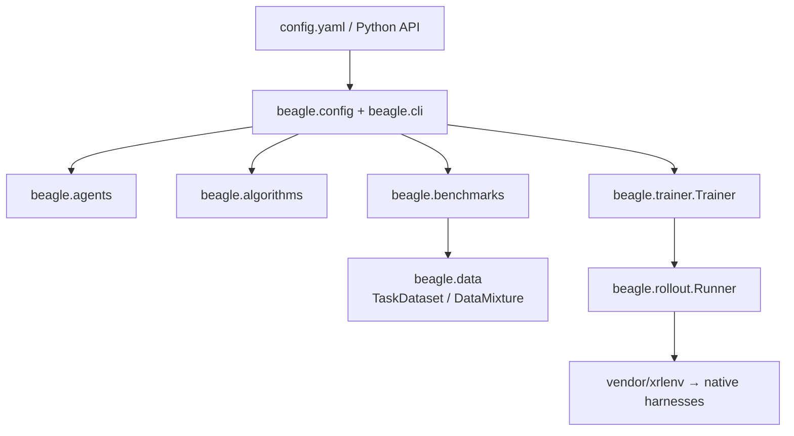

# Details & advanced

How beagle is put together, how to add your own agent adapter, and the Python API — the material
behind the [README](../README.md)'s Setup / Evaluate / Evolve walkthrough.

## Modules



Pure eval uses the same lower half: `beagle evaluate` → agent + dataset →
`beagle.eval` / `beagle.rollout` (no evolver / algorithm).

| Area | Path |
| --- | --- |
| Public facade | `beagle/__init__.py` |
| Config + CLIs | `beagle.config`, `beagle.cli` |
| Agents | `beagle.agents` |
| Algorithms | `beagle.algorithms` |
| Training loop | `beagle.trainer` |
| Data | `beagle.data` |
| Benchmarks | `beagle.benchmarks` |
| Rollout | `beagle.rollout` |
| Evaluation | `beagle.eval` |
| Tools | `beagle.tools` |
| Substrate | `vendor/xrlenv` |
| Examples / tests / notes | `examples/`, `tests/`, `notes/` |

## Onboard your own agent

Role (evolvee vs evolver) is chosen at **run time**, not baked into the agent.
Declare capabilities via mixins; `Trainer` checks the role you assign is supported:

| Capability | Implement | Meaning |
| --- | --- | --- |
| `Runnable` | `run` | attempt tasks (be scored) |
| `Evolvable` | `_default_source` | versioned git source (`repo@ref`) |
| `Editor` | `edit` | run one coding instruction (be an evolver) |

Evolvee = `Runnable` + `Evolvable`; evolver = `Editor`. The evolver is a thin
primitive — the algorithm owns prompts and the analyze/implement/review recipe.
Drop one package under `beagle/agents/` — no other edits:

```python
# beagle/agents/my_agent/__init__.py
from beagle.agents.core import Agent, AgentSource, Runnable, Evolvable, register
from beagle.rollout.runtime import ContainerRuntime
from beagle.types import Task, TaskContext, TaskResult

@register("my-agent")
class MyAgent(Agent, Runnable, Evolvable):   # white-box — usable as evolvee
    def _default_source(self):
        # source comes from run config (your experiment copy). entrypoint is intrinsic.
        return self.spec.source or AgentSource(entrypoint="bin/my-agent")

    def run(self, task: Task, task_ctx: TaskContext, *, runtime: ContainerRuntime) -> TaskResult:
        src = self.source()                   # baseline ref, or evolved candidate
        handle = runtime.acquire(image=task_ctx.image or "", command=["sleep", "infinity"])
        try:
            ...  # clone src.repo@src.ref, build, run, collect patch
            return TaskResult(task_id=task.task_id)
        finally:
            runtime.destroy(handle)
    # add Editor + edit(instruction, workspace, ...) to also serve as evolver
```

Auto-discovered on `import beagle`. One `run` works on every harness — you never
write harness-specific code. Closed-source CLI you can't evolve:
`class MyAgent(Agent, Editor)`. Start from `beagle/agents/core/_template.py`.
Benchmarks and algorithms onboard the same way — one file, `@register`, done.

## Prefer Python?

The CLI is a thin wrapper. Compose the pieces yourself (PyTorch-shaped
model / optimizer / dataloader → `fit`):

```python
import beagle as bgl

trainer = bgl.Trainer(
    evolvee=bgl.agents.build(evolvee_config),
    evolver=bgl.agents.build(evolver_config),
    algorithm=bgl.algorithms.build(darwinx_config),
    trainer_config={"runtime": {"kind": "xrlenv-cluster"}},
)
best = trainer.fit(train_dataset=bgl.TaskDataset.from_benchmark(benchmark_config))

bgl.evaluate(run_config)   # pure eval — no evolver/algorithm
```

Full example: [examples/quick-start/quick_start_inline.py](../examples/quick-start/quick_start_inline.py).
Build by name: `bgl.agents.build(...)`, `bgl.algorithms.build(...)`,
`bgl.benchmarks.get(...)`.

> **Status.** Both paths run today from one `config.yaml` — pure evaluation and the
> DarwinX loop (baseline → edit → candidate eval → keep/reject → best node + branch).
> `Trainer.fit`, DarwinX, and the version gate are wired end-to-end; `DataMixture` is
> the main piece still landing.
